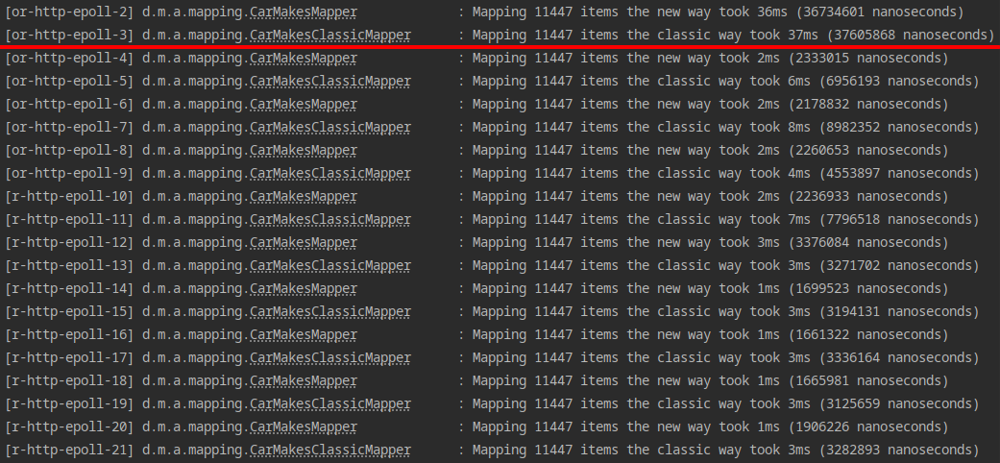

# Annotations mapping

Map deep and complex JSONs to POJOs using _configurable_ annotations.

Need to change some annotation, but you don't have time to create a release and deploy it? Don't worry, just update the
properties and you're good to go!

> Work in progress! This is just a proof of concept where the two most basic annotations (`@MapFrom` and `@MapEachFrom`)
> are already working, but there are more annotations that have to be implemented.
>
> Besides that, the code should be improved. I created this in a couple of hours and my main goal was to get something
> working, so there are things that could definitely be done better.
>
> Also, check the `TODO` in the `JsonMapping` class, where I talk about another implementation that could allow for a
> simpler code.

## Annotations

### `@MapFrom` and `@MapEachFrom`

These are the most basic annotations and the ones you will use the most:

- `@MapFrom`: maps a single field
- `@MapEachFrom`: maps multiple objects from an array

#### Examples

Assuming you have DTOs like this:

```java
package dev.matiaspg.annotationsmapping.dto;

@Data
public class HackerNewsPosts {
    @MapEachFrom("/hits")
    private List<HackerNewsPost> posts;
}

@Data
public class HackerNewsPost {
    @MapFrom("/story_id")
    private String id;

    @MapFrom("/title")
    private String title;

    @MapFrom("/points")
    private Integer points;

    @MapFrom("/num_comments")
    private Integer numberOfComments;

    @MapFrom("/url")
    private String url;
}
```

And a JSON like this:

```json
{
  "hits": [
    {
      "num_comments": 403,
      "points": 610,
      "story_id": 25300396,
      "title": "Self-host your fonts for better performance",
      "url": "https://wicki.io/posts/2020-11-goodbye-google-fonts/"
    },
    {
      "num_comments": 335,
      "points": 538,
      "story_id": 21235957,
      "title": "Ask HN: What do you self-host?"
    }
  ]
}
```

The resulting mapping will be this:

```json
[
  {
    "id": "25300396",
    "title": "Self-host your fonts for better performance",
    "points": 610,
    "numberOfComments": 403,
    "url": "https://wicki.io/posts/2020-11-goodbye-google-fonts/"
  },
  {
    "id": "21235957",
    "title": "Ask HN: What do you self-host?",
    "points": 538,
    "numberOfComments": 335,
    "url": null
  }
]
```

#### Options

TODO

### `@AfterMapping`

TODO

### `@ConcatMapFrom`

TODO

### `@MapManually`

TODO

## Configuring annotations

This app supports "configuring" annotations from:

- Class fields
- Class methods
- Parameters of class methods
- Class themselves (not used for now, but it may be useful in the future)

To do that, you have to define an array of "replacements" in your properties with a JSON syntax.

### From a class field

Required fields:

- `targetClass`: full "path" of the class containing the annotation
    - Example: `dev.matiaspg.annotationsmapping.dto.HackerNewsPost`
- `targetField`: name of the field containing the annotation
- `annotationClass`: the full "path" of the annotation class whose values you want to replace
    - Example: `dev.matiaspg.annotationsmapping.annotations.MapFrom`
- `replacements`: key-value map with the name of the annotation method you want to replace, and the new value

### From a class method

Required fields:

- `targetClass`: full "path" of the class containing the annotation
    - Example: `dev.matiaspg.annotationsmapping.dto.HackerNewsPost`
- `targetMethod`: name of the method containing the annotation
- `annotationClass`: the full "path" of the annotation class whose values you want to replace
    - Example: `dev.matiaspg.annotationsmapping.annotations.MapFrom`
- `replacements`: key-value map with the name of the annotation method you want to replace, and the new value

### From a parameter of a class method

- `targetClass`: full "path" of the class containing the annotation
    - Example: `dev.matiaspg.annotationsmapping.dto.HackerNewsPost`
- `targetMethod`: name of the method
- `targetMethodParam`: name of the parameter containing the annotation
- `annotationClass`: the full "path" of the annotation class whose values you want to replace
    - Example: `dev.matiaspg.annotationsmapping.annotations.MapFrom`
- `replacements`: key-value map with the name of the annotation method you want to replace, and the new value

### From a class itself

> There is no mapping annotation that you can apply on classes as of now, so this is _useless_ for now. Still, once a
> use case is found, it will be there.

- `targetClass`: full "path" of the class containing the annotation
    - Example: `dev.matiaspg.annotationsmapping.dto.HackerNewsPost`
- `annotationClass`: the full "path" of the annotation class whose values you want to replace
    - Example: `dev.matiaspg.annotationsmapping.annotations.MapFrom`
- `replacements`: key-value map with the name of the annotation method you want to replace, and the new value

### Full example

Assuming you have the `HackerNewsPost` (notice singular) DTO from above and this updated `HackerNewsPosts` DTO:

```java

@Data
public class HackerNewsPosts {
    private List<HackerNewsPost> posts;
    private String query;
    private Boolean nsfw;

    @MapEachFrom("/hits")
    private void setPosts(List<HackerNewsPost> posts) {
        this.posts = posts;
    }

    private void setMultipleValues(
        @MapFrom("/meta/query") String query,
        @MapFrom(value = "/meta/nsfw", defaultValue = "true") Boolean nsfw
    ) {
        this.query = query;
        this.nsfw = nsfw;
    }
}
```

You can replace annotation values by putting the following in your properties:

```properties
dev.matiaspg.mapping.annotationReplacements=[\
  {\
    "targetClass": "dev.matiaspg.annotationsmapping.dto.HackerNewsPost",\
    "targetField": "id",\
    "annotationClass": "dev.matiaspg.annotationsmapping.annotations.MapFrom",\
    "replacements": { "value": ["/v2/story_id"] }\
  },\
  {\
    "targetClass": "dev.matiaspg.annotationsmapping.dto.HackerNewsPosts",\
    "targetMethod": "setPosts",\
    "annotationClass": "dev.matiaspg.annotationsmapping.annotations.MapEachFrom",\
    "replacements": { "value": "/v2/hits" }\
  },\
  {\
    "targetClass": "dev.matiaspg.annotationsmapping.dto.HackerNewsPosts",\
    "targetMethod": "setMultipleValues",\
    "targetMethodParam": "nsfw",\
    "annotationClass": "dev.matiaspg.annotationsmapping.annotations.MapFrom",\
    "replacements": { "value": ["/v2/meta/nsfw", "/v3/meta/nsfw"] }\
  }\
]

```

> I know it looks kind of ugly, but it's because `properties` files require you to escape new lines. In YAML it would
> probably look much better.

With those replacements, the following things changed:

- `HackerNewsPost#id` now works as if it was annotated with `@MapFrom("/v2/story_id")`
- `HackerNewsPosts#setPosts()`  now works as if it was annotated with `@MapEachFrom("/v2/hits")`
- `HackerNewsPosts#setMultipleValues()` now works as if the `nsfw` parameter was annotated
  with `@MapFrom(value = {"/v2/meta/nsfw", "/v3/meta/nsfw"}, defaultValue = "true")` (notice how the `defaultValue` is
  kept the same)

## Performance

The performance of mapping with annotations is, surprisingly, VERY good.

Take a look at the following screenshot for example:


In the screenshot you see the time it took to map 11447 items using annotations vs the "classic" way.

> The "classic" way of mapping is by using mapping functions, like
> [here](https://github.com/matias-pg/java-annotation-mapping/blob/master/src/main/java/dev/matiaspg/annotationsmapping/mapping/CarMakesClassicMapper.java).

As you can see, the first mapping took almost the same time in both approaches, which is surprising to me because I
thought it would take much longer due to Reflection.

But what surprises me the most is **how much faster it's after the first mapping**. I knew it would be fast because a
lot of stuff is cached after the first mapping, but I didn't expect it to be **up to 4 times faster** than the classic
way.

The difference is in single digit milliseconds but still, I didn't think it would be faster than the classic way **even
with the optimizations**. Very happy with the results.

> Disclaimer: the testing was done in an AMD Ryzen 5950X CPU, which has 16 cores and 32 threads, so the results may be
> different in other devices/environments (e.g. the cloud).
